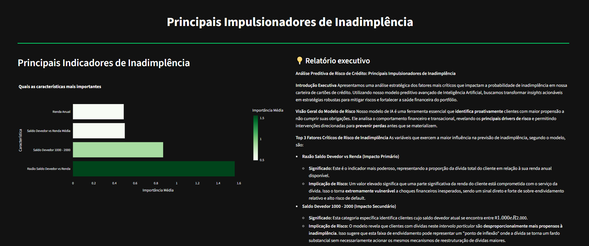

# ML Classifier - 💳 Credit Card Default Prediction

- A fully automated pipeline for credit card default prediction, built with production-grade best practices.
- Data Source: [Kaggle Dataset](https://www.kaggle.com/datasets/d4rklucif3r/defaulter)

- This project includes an independent Explainability Interface to provide transparency into model decisions.



# 🔹 Objective:
To create a solid and scalable foundation for data science and machine learning projects, enabling teams to reliably and auditably train, validate, and deploy models.

## 📂 Project Structure

```
/mlops_project
├── app/                          # Web application
│   ├── main.py                   # Flask app with prediction API
│   └── templates/                # HTML templates for web UI
│       └── index.html            # Web interface for predictions
├── artifacts/                    # Preprocessing artifacts
├── dags/                         # DAGs for orchestration
│   └── ml_pipeline_dag.py        # Automated pipeline DAG
├── data/                         # Data storage
│   ├── preprocessed/             # Cleaned data
│   ├── processed/                # Feature-engineered data
│   └── raw/                      # Raw dataset
├── metrics/                      # Model performance metrics
├── mlruns/                       # MLflow experiment tracking
├── models/                       # Trained models
├── src/                          # Source code modules
│   ├── data_loading/             # Data loading utilities
│   │  └── load_data.py           # Dataset loading and preparation
│   ├── data_preprocessing/       # Data cleaning and splitting
│   │  └── preprocess_data.py     # Data cleaning and imputation
│   ├── feature_engineering/      # Feature transformation utilities
│   │  └── engineer_features.py   # Feature scaling and transformation
│   ├── model_evaluation/         # Model evaluation scripts
│   │  └── evaluate_model.py      # Model performance evaluation
│   └── model_training/           # Model training scripts
│       └── train_model.py        # XGBoost training
├── xai.py                        # Explainable AI utilities (SHAP, interpretability)
├── register_artifacts.py         # Pipeline artifact registration
├── config.toml                   # General configuration
├── .dockerignore                 # Docker ignore rules
├── Dockerfile                    # Docker build instructions
├── Dockerfile.airflow            # Dockerfile for Airflow
├── docker-compose.airflow.yaml   # Compose for Airflow orchestration
├── params.yaml                   # Configuration parameters
├── pyproject.toml                # Python dependencies and project metadata
└── README.md                     # Project documentation

```


## Features

- **Data Pipeline**: Complete ETL pipeline from raw data to model-ready features
- **XGBoost Model**: XGBoost Classifier model with configurable architecture
- **Web Interface**: Flask-based web application for making predictions
- **Artifact Management**: Serialized models and preprocessors for deployment
- **Evaluation Metrics**: Comprehensive model performance analysis

## Dependencies

The project requires Python 3.11+ and the packages informed in `pyproject.toml`.

## Installation

1. Clone the repository:
```bash
git clone https://github.com/Ronizorzan/credit-default-pipeline.git
cd mlops_project
```

2. Install dependencies:
```bash
pip install -e .
```

## Configuration

Model hyperparameters and data processing settings are configured in `params.yaml`.

## Model Architecture and techniques

- **Model:** XGBoost, pre-trained in Kaggle with feature engineering techniques.
- **Optimization:** Bayesian search for best hyperparameters
- **Notebook Kaggle:** [Implementation here](https://www.kaggle.com/code/ronivanzorzanbarbosa/creditcarddefaultprediction-featureengineering)


## Artifacts

The training process generates the following files:

In the `models/` directory:
- `xgb_model.joblib`: Trained XGBoostClssifier model

In the `artifacts/` directory:
- `balance_discretizer.joblib` : Balance Column Binnig
- `preprocessor.joblib`: Missing value Imputation (numerical and categorical)
- `feature_selector.joblib`: Best Features selection
- `target_encoder.joblib`: Target-based categorical encoding

## Metrics

Model performance metrics are saved to:
- `metrics/training.json`: Training history and validation metrics
- `metrics/evaluation.json`: Test set performance and confusion matrix

## Development

The project follows a modular structure with separate concerns:
- **Data Loading**: Fetches and saves raw credit-card-default dataset
- **Preprocessing**: Handles missing values and data splitting
- **Feature Engineering**: Applies transformations to improve model metrics
- **Model Training**: Builds and trains the XGBoost Classifier Model
- **Model Evaluation**: Generates performance metrics
- **Web Application**: Provides prediction interface

Each module can be run independently and saves its outputs for the next stage in the pipeline.

## Usage

### Training the Model

Run the complete ML pipeline (for proper logging to the terminal, run as modules with `python -m`):

```bash
# 1. Load and prepare raw data
python -m src.data_loading.load_data

# 2. Preprocess data (imputation, train/test split)
python -m src.data_preprocessing.preprocess_data

# 3. Engineer features (scaling)
python -m src.feature_engineering.engineer_features

# 4. Train the neural network model
python -m src.model_training.train_model

# 5. Evaluate model performance
python -m src.model_evaluation.evaluate_model
```

### Running the Web Application

#### Flask

After training the model, start the Flask web server:

```bash
python app/main.py
```

The application will be available at `http://localhost:5001`

### Docker

You can instead build and run the application using Docker:

#### Build the Docker image

```bash
docker build -t ml-classifier .
```

#### Run the Docker container

```bash
docker run -p 5001:5001 ml-classifier
```

The web application will be available at `http://localhost:5001`.

### Making Predictions

1. **Web Interface**: Upload a CSV file with breast cancer features through the web interface
2. **API** The `/manual` endpoint accepts manual insertions and return unique predictions
3. **API**: The `/upload` endpoint accepts CSV files and returns predictions

1[Web-Interfaca-app](Interface-app.png)

